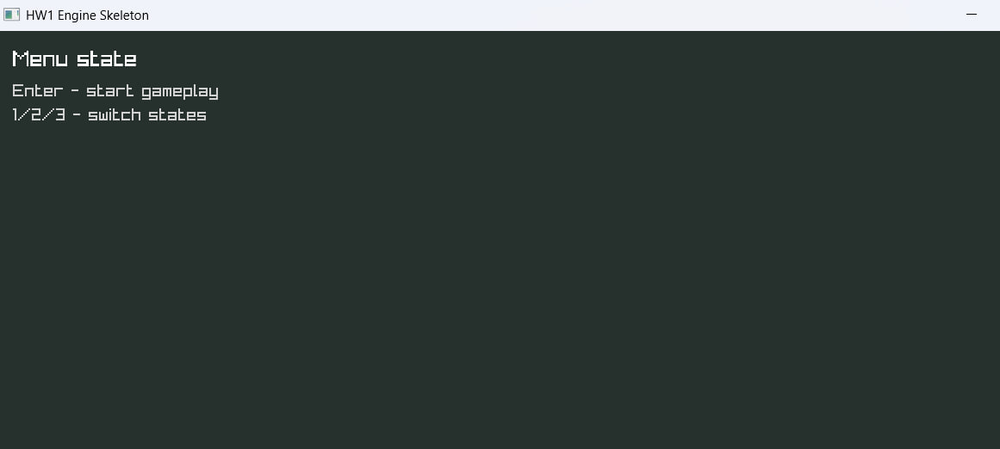
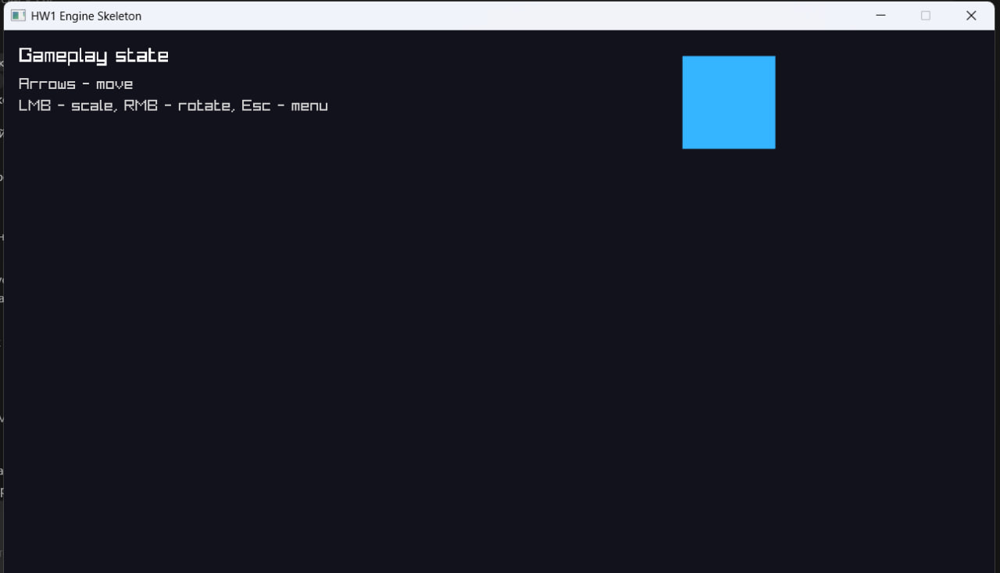

# Практическое занятие №1: Каркас игрового движка и базовая интеграция рендера

Практическое занятие №1 по дисциплине, связанной с архитектурой игровых движков.

Студент: `Иманаков Владислав Павлович`  
Группа: `J3300`

Реализован минимальный каркас игрового приложения на `C++17` с:
- главным игровым циклом;
- расчетом `deltaTime`;
- системой состояний;
- логированием;
- адаптером рендеринга (`RenderAdapter`);
- тестовым примитивом в окне;
- обработкой клавиатуры и мыши (дополнительное задание).

## Скриншоты

### Меню



### Игровой режим



## Технологии

- `C++17`
- `CMake`
- `raylib` (через `FetchContent`)

## Структура проекта

- `src/core` — каркас приложения, логирование, состояния
- `src/render` — интерфейс и реализация адаптера рендера
- `src/game` — обработка ввода и управление объектом
- `docs` — документация по архитектуре и материал для отчета

## Сборка (Windows, Visual Studio 2022)

Требуется установленный `Git`, `CMake` и workload Visual Studio: `Разработка классических приложений на C++`.

```powershell
cmake -S . -B build
cmake --build build --config Release
.\build\Release\hw1_aid.exe
```

Для Visual Studio (режим CMake):
- открыть папку проекта;
- дождаться конфигурации CMake;
- выбрать цель запуска `hw1_aid`;
- запустить `Ctrl+F5`.

## Управление

- `1` — Loading
- `2` — Menu
- `3` — Gameplay
- `Enter` — переход из меню в геймплей
- `Esc` — возврат в меню
- `Стрелки` — перемещение примитива
- `ЛКМ` — масштабирование
- `ПКМ` — вращение

## Что реализовано по заданию

1. `Application` с жизненным циклом (`initialize/run/shutdown`)
2. Игровой цикл и расчет `deltaTime` через `std::chrono`
3. Система состояний (`Loading`, `Menu`, `Gameplay`)
4. Система логирования (консоль + файл)
5. `RenderAdapter` и конкретная реализация для `raylib`
6. Отрисовка тестового примитива в окне
7. Дополнительно: ввод клавиатуры и мыши с учетом `deltaTime`

## Формулировка задания (по PDF)

Тема: `Каркас игрового движка и базовая интеграция рендера`.

Цель: создать минимальный рабочий каркас игрового движка с поддержкой игрового цикла и визуализации графического вывода через адаптер рендеринга.

Основные пункты задания:
- реализовать класс `Application`;
- реализовать игровой цикл и расчет `deltaTime`;
- реализовать систему состояний игры;
- настроить логирование;
- реализовать `RenderAdapter`;
- отрисовать тестовый примитив в графическом окне.

## Материалы для отчета

См.:
- `docs/ARCHITECTURE.md`
- `docs/REPORT_NOTES.md`
- `docs/CONTROL_QUESTIONS.md`
